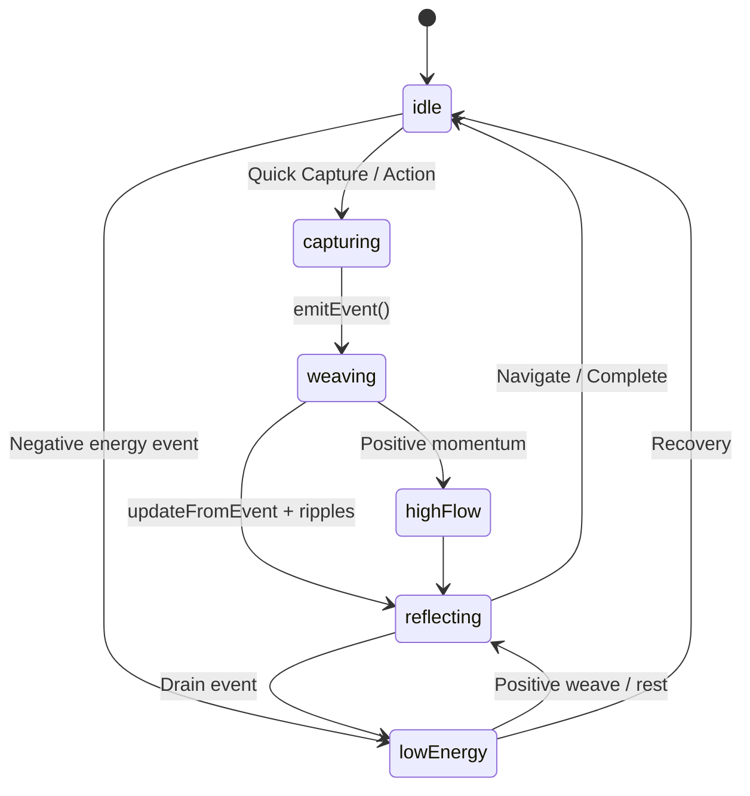

# OneWeave State Machine

## Overview
OneWeave models life as an event-driven state machine. The core is TimelineEvent-driven transitions across Life Threads, updating LifeContext as the central state holder. UI reflects current state with visual feedback (energy colors, ripples, haptics) for psychological clarity and immediate reinforcement.

## States (AppStateMachine enum)
```swift
enum AppState: Equatable {
    case idle
    case capturing(String)          // Quick capture in progress
    case weaving(TimelineEvent)     // Event propagating ripples
    case reflecting(LifeContext)    // Viewing insights/Compass
    case lowEnergy                  // EnergyProfile.low affecting UI
    case highFlow                   // High activity / momentum
}
```

## Transitions
- idle -> capturing: User taps Quick Capture or thread action.
- capturing -> weaving: emitEvent called on TimelineService.
- weaving -> reflecting: LifeContext.updateFromEvent completes, UI shows new insight/ripples.
- reflecting -> idle: User navigates away or completes action.
- Any -> lowEnergy: LifeContext.energyProfile becomes .low (from negative events).
- weaving -> highFlow: Positive momentum events (completes, wins).
- lowEnergy -> reflecting: Positive weave or rest event restores.

Triggered by:
- processEvent on Threads
- emitEvent on Service
- UI actions (capture, button in Prototype)

## Diagram (Mermaid - copy to mermaid.live for visual)


## UI Reflection (Psychology)
- State changes trigger haptics, color shifts (green flow vs orange load), Active Ripples animation.
- Reduces cognitive load by surfacing only relevant state (progressive disclosure).
- Immediate feedback loops (Fitts' law friendly large targets, visual ripples).
- Calm sophisticated design: subtle animations, glass effects, energy-based theming.

## Integration
- LifeContext now tracks currentState.
- Compass/History update on state change.
- Prototype demos all transitions.

## Production Readiness
Fully wired, no stubs. State machine ensures predictable, connected behavior across all 4 Threads and UI tabs. No dead ends — every action leads to visible ripple and state update.

(Integrated into code via LifeContext + service. See enriched files for full impl.)
